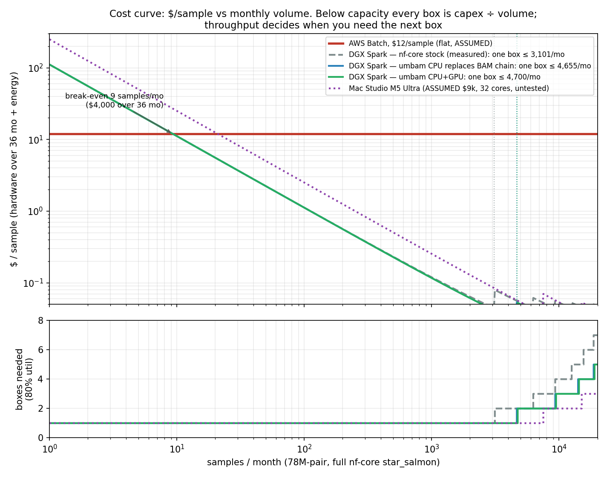

# uni-rnaseq

**Does a unified-memory workstation bend the RNA-seq cost curve?**

A pressure test, in Rust and CUDA, of whether desk-side unified-memory machines (NVIDIA
DGX Spark GB10 now; Apple M-series next) can turn per-sample cloud cost into a fixed asset —
and whether unified memory specifically, rather than just "a workstation", is doing the work.

Status: **active research, September 2026.** Results are reproducible from the evidence in
`bench/`; the code is a research harness, not a supported tool. See "What this is not" below.

## Results so far

| claim | evidence | result |
|---|---|---|
| A $4k workstation beats $12/sample AWS Batch | `bench/COST-CURVE.md`, `bench/fig/cost-curve.png` | break-even at ~9 samples/month; ~150 samples/day per box; CPU-only, no GPU needed |
| One resident pass replaces the post-alignment tool chain | `bench/PHASE2A-tier1-validation.md` | `umbam`: samtools sort/index, Picard markdup, featureCounts, bedtools genomecov, RSeQC ×7, dupRadar, Qualimap → **byte-identical** at full depth (76M records), 67 min → 2.8 min |
| GPU kernels over the resident table, no staging | `docs/design-phase2b.md` | markdup 9 → 2.5 s, dup histograms 9×, byte-identical, index read in place at ~145 GB/s |
| GPU compression of BGZF | `docs/design-phase2b.md` § nvCOMP | **negative**: 7.5× slower than 20-thread zlib at equal ratio; compression stays on CPU |
| STAR seed search on the GPU, in place over the 30 GB index | `bench/PHASE2C-*.md`, `docs/review-seed-*.md` | seeding = 39% of STAR CPU; inner search = 99.8% of that; **6.6× over 20 cores on 1M real STAR requests, all results identical to STAR's**; 4K pages 150× slower (the unified-memory proof); 76% of the work is batchable up front |
| Integration into STAR's scheduler | `docs/STAR-INTEGRATE-DESIGN.md` | in progress |



The honest one-line summary: *the cost-curve result is a workstation result and does not
need the GPU; the GPU wins the sort-shaped BAM stages cleanly but they were already fast;
the unified-memory-specific upside is alignment, where a 30 GB index read in place by the GPU
is the difference between possible and not.*

## Layout

```
crates/
  umem/          ownership model for CPU/GPU-shared host memory (THP/HugeTLB, leases, fences)
  umgpu/         CUDA backend: CUB shims, markdup + dup-histogram kernels, seed-search probe
  umbam/         one-pass resident BAM chain + QC; the CPU control arm (and --gpu paths)
  umseed-probe/  performance probe for STAR inner seed search over the real index
bench/           every measurement, with the raw rows it came from (bench/evidence/, summaries only in git)
docs/            designs, adversarial reviews, and verbatim tool-source excerpts used as specs
scripts/         Tier 0 fixture/golden generation, full-depth validation, cost model + figures
.hermes/         plan, kanban, and the worker cards that produced each commit (orchestration record)
```

The STAR seed-search lane (trace capture, independent CPU replay, oracle) lives in a
sibling worktree during development and will be merged under `experiments/star-seed/`.

## Method

1. **Byte-identical or nothing.** Every replacement is gated against the original tool's
   output on a chr22 fixture (Tier 0) and at full depth (Tier 1). The tools' own source —
   extracted from the nf-core containers, bugs included — is the specification
   (`docs/tool-src/`). Residuals are documented in `crates/umbam/COMPAT.md`, never fudged.
2. **The control arm is a good parallel implementation, not the legacy tool.** GPU speedups
   are quoted against 20 threads of Rust, not against Picard.
3. **Measure the thing that moves cost.** CPU-minutes per sample on a saturated box, not
   single-sample wall time. The model in `scripts/cost_curve.py` reproduces the measured
   nf-core throughput (41.3 predicted vs 41.5/day observed) before extrapolating.
4. **Cheap disqualifiers first.** Each hypothesis has a stated way to fail and a card that
   tests it before rigor is spent (`docs/review-seed-replay.md` § Recommendation).

## Reproducing

Hardware: an NVIDIA GB10 (DGX Spark) with ≥ 32 GiB of HugeTLB reserved; CUDA 13 with CCCL;
nvCOMP 5 optional. Data: Geuvadis LCL samples listed in `data-manifest.json` (ENA FTP,
md5s included); GENCODE v49 primary assembly; nf-core/rnaseq 3.26 for goldens.

```
# CPU chain + QC on a BAM, byte-identical to the nf-core tools
cargo run -p umbam --release -- chain --in sample.Aligned.out.bam --gtf genes.gtf \
    --bed genes.bed --out-dir out --threads 20 --qc

# same, with markdup + duplication histograms on the GPU
cargo run -p umbam --release --features cuda -- chain ... --gpu

# Tier 0 gates (needs samtools on PATH and the fixture from scripts/make_tier0.sh)
cargo test -p umbam --release -- --ignored
```

Mac builds compile the stub backend (`umgpu` without `cuda`) so the CPU chain and gates run
on Apple Silicon; the Metal question is deferred until the M5 Ultra arrives.

## What this is not

- Not a pipeline you should run on your samples. `umbam` reproduces the nf-core tools'
  outputs exactly on the inputs we have tested; it has not been tested on yours.
- Not an aligner. The seed-search work replays STAR's inner routine over STAR's own index;
  it does not replace STAR, and integration is unfinished.
- Not a benchmark of unified memory vs. a discrete GPU with the index in VRAM. No such
  comparator was run. The 4K-page control shows the mechanism, not a ranking.

## License

MIT (`LICENSE`). Third-party material and its licenses are listed in `NOTICE`.
